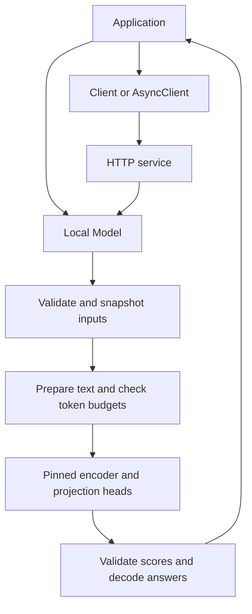

# Architecture

Kayak provides typed decision contracts, a local CLM runtime, synchronous and
asynchronous HTTP clients, provider adapters, and evaluation tools. Local and
HTTP CLM calls use the same decision computation. The application owns its
inputs, policies, and resulting actions.

## Request flow

`decide` evaluates Choice questions. `rank` builds a Choice request and returns
its candidates in score order. `judge` compiles Choice, Noul, and Score questions
into Choice requests, then decodes the result into typed answers. These adapters
share execution and validation policy; they do not introduce additional HTTP
endpoints or a separate inference engine.

The [Python API](api.md) defines input and output contracts. The
[model contract](model-contract.md) defines the exact text recipe, tokenizer,
pooling, projections, and numerical operations.

## Components and ownership

| Component | Responsibility |
| --- | --- |
| `decisions.py` | Choice contracts, input snapshots, score validation, and distributions |
| `judgments.py` | Pure compilation and decoding of typed questions |
| `ranking.py` | Pure conversion between ranking and Choice values |
| `runtime/_preparation.py` | Text preparation and token-budget checks |
| `bundle.py`, `runtime/_loading.py` | Manifest validation, artifact resolution, and allocation of model resources |
| `runtime/_model.py`, `_heads.py` | Serialized encoder execution, projections, scoring, and model cleanup |
| `client.py` | HTTP connection lifetime, request serialization, response validation, and error translation |
| `server.py` | Readiness, bounded admission, inference lifetime, and shutdown |
| `adapters/` | Calls to existing Laya/Jev objects and validation of provider-reported results |
| `eval/` | Labeled cases, callback execution, recorded observations, metrics, and reports |

Importing the base package does not load weights or import the inference stack.
`load()` imports the optional libraries, validates artifacts, and constructs one
resident model. The caller closes it with a context manager or `close()`.

## Data and model identity

Request validation snapshots caller mappings. Contract objects prevent field
reassignment, but nested dictionaries can still be mutated; typed inputs are
therefore revalidated and copied at execution boundaries.

Candidate descriptions carry model meaning. Question and candidate IDs identify
results and are preserved without being appended to CLM input. Unknown fields,
invalid values, oversized requests, and token overflow are rejected. Context is
never silently truncated. Ties retain candidate order.

A versioned manifest pins the encoder and projection artifacts and the input
recipe. Results retain that fingerprint, revisions, device, and precision.
Loading disables remote Python code and validates projection integrity before
inference. The model remains fixed for its lifetime.

The runtime can reuse the last ordered block of candidate encoder vectors at
batch size one when token rows match exactly. The resident model owns this
bounded cache under the same execution lock and releases it on close. The
[model contract](model-contract.md#data-path) describes its validation and
numerical boundaries.

## Execution and failure boundaries

Local calls are serialized by the model lock. The HTTP service owns one model
and one active inference task, with no request queue. It reports readiness only
after loading and a readiness decision succeed. Busy requests receive 503.

A response timeout or disconnected caller does not stop an active accelerator
operation. That operation retains capacity until completion. Shutdown stops
admission, waits for active work, and closes the model. Clients do not retry
requests automatically. The [serving guide](serving.md) specifies statuses,
timeouts, authentication, and deployment configuration.

`/v1/decide` accepts Choice requests. Python `judge` and `rank` use that same wire
contract and decode their additional result types locally. Existing request and
response bodies remain fixed under the [compatibility policy](compatibility.md).

Provider adapters borrow caller-owned objects. They send the original typed
questions to the provider and return `ProviderResult`, preserving provider
values and missing evidence. They do not apply CLM score semantics to another
model or own its configuration, retries, or cleanup. See
[provider adapters](provider-adapters.md).

## Retrieval and evaluation

Applications supply retrieved text as decision state. Retrieval, context
assembly, optional text generation, and action execution stay in application
code. Kayak does not introduce a RAG orchestration runtime.

Evaluation keeps observations separate from references and reviews. Pure
assessors compare recorded values. Experiment runners execute supplied sync or
async callables, retain failures and repetitions, and bound owned async workers.
Reports include the effective configuration and evidence used for each metric.
Missing observations or judgments remain unknown. See [RAG evaluation](rag-evaluation.md)
and [experiment execution](rag-experiments.md).

## Verification

Contract and property tests exercise validation, ordering, ownership, and
malformed responses. Event-controlled tests exercise admission, timeout,
cancellation, and shutdown. An isolated client/server matrix checks the `/v1`
contract across installed versions. Tiny-model and released-head checks cover
numerical integration within their stated scope.

Full-model hardware behavior and application quality require separate runs.
The [release checklist](release.md) identifies the evidence needed for a release;
passing code tests alone does not establish model quality or capacity.
