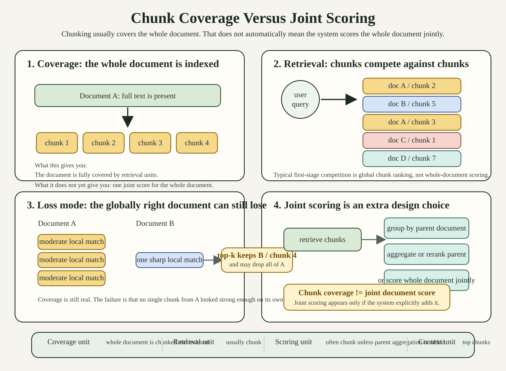

# Chunk Coverage Versus Joint Scoring

This note exists for one recurring confusion:

- "if the system chunks the whole document, doesn't that already cover the
  whole document?"

Yes, it covers the whole document in storage and indexing terms.

No, that does **not** automatically mean the system scores the whole document
jointly.

That distinction is important enough that the course should explain it
directly, not only imply it across several lessons.

## Visual Asset

Use this image when you need one slide or one notebook cell that answers the
confusion quickly.



Runnable toy notebook:

- [notebooks/chunk_coverage_vs_joint_scoring.ipynb](notebooks/chunk_coverage_vs_joint_scoring.ipynb)

## Producer Usage

If a producer wants one small visual markdown cell for a notebook, the safest
ready-to-paste version is:

```md
### Chunking Covers The Whole Document, But Usually Scores Chunks


- Chunking covers the whole document in indexing terms.
- Retrieval often still happens chunk-by-chunk.
- One sharp local chunk can beat several moderate chunks from the globally right document.
- Joint document scoring is an extra design choice, not an automatic consequence of chunking.
```

Short presenter script:

- "Yes, the whole document is covered."
- "But the retrieval unit is still often the chunk."
- "So one strong local chunk from the wrong document can beat several moderate chunks from the right one."
- "Joint document scoring only appears if the system explicitly adds grouping, aggregation, reranking, or whole-document late interaction."

## One-Sentence Answer

Chunked retrieval usually means:

- every document is broken into many overlapping chunks
- search runs over those chunks
- the best chunks win

It does **not** automatically mean:

- the system combines all evidence from all chunks of one document into one
  joint document score

## Why People Get Confused

From a user's point of view, the intuition is natural:

- "if every part of the document is indexed, then the document should be
  retrievable as a whole"

The hidden assumption is:

- coverage implies joint reasoning

But those are different operations.

Coverage answers:

- "can some part of this document be found at all?"

Joint scoring answers:

- "can the system evaluate the evidence spread across the document as one
  coherent object?"

Many production systems do the first.
Far fewer do the second.

## Diagram 1: What Chunking Actually Does

```text
One document

[ full document text ]
        |
        v
split into overlapping chunks
        |
        v
[chunk 1] [chunk 2] [chunk 3] [chunk 4]
```

This means:

- the document is covered by chunks
- each chunk becomes a retrieval unit

This does **not** yet mean:

- the document is scored as one whole object

## Diagram 2: What Search Usually Sees

```text
Query
  |
  v
search over all chunks from all documents
  |
  v
doc A / chunk 2
doc B / chunk 5
doc A / chunk 3
doc C / chunk 1
doc D / chunk 7
```

What usually competes is:

- chunk against chunk

not:

- document against document as a jointly scored whole

So even if document A contains the full answer across several chunks, document B
can still win because one of its chunks has a sharper local match.

## Diagram 3: Where Information Can Be Lost

```text
document A
  chunk 1 -> weak local match
  chunk 2 -> weak local match
  chunk 3 -> weak local match

document B
  chunk 4 -> strong local match

top-k chunk retrieval keeps:
  B/chunk 4

and may drop:
  A/chunk 1, A/chunk 2, A/chunk 3
```

This is the practical failure mode:

- document A may be globally right
- but no single chunk from A looks strong enough on its own

So the system says:

- "best local chunk"

when the user needed:

- "best document-level evidence pattern"

## What Chunking Gives You

Chunking is useful for real reasons.

It gives you:

- local evidence isolation
- smaller retrieval units
- easier indexing and serving
- compatibility with vector DBs and hybrid retrieval stacks
- better behavior when the answer is concentrated in one local region

This is why chunking is common.
It is not a bad idea by default.

## What Chunking Does Not Give You For Free

Chunking does **not** automatically give you:

- document-level aggregation
- multi-chunk reasoning
- cross-chunk conjunction scoring
- guarantee that several moderate chunks from one document will beat one strong
  chunk from another
- guarantee that overlapping chunks will preserve long-range evidence

Overlap helps with boundary effects.
It does not solve all composition problems.

## Common Production Patterns

The course should explain that "chunked retrieval" can mean several different
systems.

### Pattern 1: Chunked Dense Retrieval

```text
documents -> chunks -> embedding per chunk -> vector search -> top chunks
```

What this means:

- dense matching happens at chunk level
- final results are often the top chunks themselves

### Pattern 2: Chunked Hybrid Retrieval

```text
documents -> chunks -> lexical + semantic retrieval -> fused top chunks
```

What this means:

- keyword matching and embedding matching both help candidate generation
- retrieval is still usually chunk-level first

Hybrid retrieval can improve recall.
It still does not automatically create joint document scoring.

### Pattern 3: Chunked Retrieval Plus Chunk Reranking

```text
retrieve top chunks -> rerank chunks -> send best chunks to model
```

What this means:

- the reranker usually sees chunk candidates
- if the needed document never survived chunk retrieval, reranking cannot fix
  that

### Pattern 4: Chunked Retrieval With Parent-Document Grouping

```text
retrieve top chunks -> map chunk to parent document -> aggregate by parent
```

This gets closer to document-level reasoning, but aggregation is now a design
choice.

Questions still matter:

- do you take max over chunks?
- sum?
- top-2?
- rerank parent docs after expansion?

That logic is not automatic.

### Pattern 5: Exact Late Interaction On Whole Documents

```text
query token vectors
vs
document token vectors for the whole document
```

This is different in kind:

- the document stays one jointly scored object
- multiple evidence-bearing regions can contribute to the score inside the same
  document

This is why late interaction is a useful reference path.

## The Real Distinction

The distinction the course should teach is:

- chunk coverage
- retrieval unit
- scoring unit
- context unit

Those can all be different.

Example:

- coverage unit: whole document is fully chunked
- retrieval unit: chunk
- scoring unit: chunk
- context unit: top 10 chunks

That is a very common architecture.

Another example:

- coverage unit: whole document
- retrieval unit: chunk candidates
- scoring unit: parent document after aggregation or reranking
- context unit: selected passages from winning documents

That is a stronger architecture, but still different from exact late
interaction over whole documents.

## FAQ

### "If the whole document is chunked, isn't the whole document represented?"

Yes.

But representation is not the same as joint scoring.

The document is represented as many retrieval units, not necessarily as one
jointly scored object.

### "If multiple chunks from the same document match, won't the system combine them?"

Only if it is explicitly designed to do so.

Many systems do not combine them beyond:

- max chunk score
- top chunk wins
- a simple parent-grouping heuristic

### "Does overlap solve this?"

Overlap helps when the evidence is split by a hard boundary.

Overlap does not guarantee:

- long-range multi-chunk composition
- document-level conjunction scoring
- stable aggregation across several moderate chunks

### "Does hybrid retrieval solve this?"

Hybrid retrieval can help recall a lot.

It helps answer:

- "can the right chunk be found?"

It does not automatically answer:

- "can the full document be scored jointly?"

### "So why not always use whole-document late interaction?"

Because chunked systems have real advantages:

- lower retrieval cost
- easier scaling
- compatibility with standard vector stores
- strong performance when answers are local

So the course should not teach:

- "chunking is wrong"

It should teach:

- "chunking and whole-document late interaction optimize different things"

## When Chunking Is Often Enough

Chunking is often enough when:

- the answer lives in one compact span
- one chunk can carry most of the evidence
- the main issue is lexical or topical matching, not long-range composition

## When Chunking Often Becomes Fragile

Chunking becomes more fragile when:

- the evidence is spread across multiple parts of the same document
- one sharp distractor chunk can beat several moderate evidence chunks
- candidate budgets are small
- only a few chunks reach reranking or generation
- the system never explicitly aggregates by parent document

## Why This Matters For Kayak

Kayak is useful here for two distinct reasons.

First:

- it gives an exact late-interaction reference path

Second:

- it lets us compare simplifications against that path explicitly

So the teaching move is not:

- "everyone should stop chunking"

It is:

- "be explicit about whether your system is covering the document, scoring the
  document, or only scoring chunks"

That distinction explains a large fraction of real user confusion.

## How This Should Be Taught

This note should be used when learners ask questions like:

- "but the whole document is chunked, so why is it still missing?"
- "aren't several chunks from the same document enough?"
- "if we use hybrid retrieval, doesn't that already solve it?"

The answer should start from architecture, not ideology.

That is:

- what is the retrieval unit?
- what is the scoring unit?
- what gets passed to the model?

Only after that should we discuss:

- chunk size
- overlap
- reranking
- late interaction

## Safe Takeaway

The safest short takeaway is:

- chunking covers the whole document
- but retrieval usually still happens chunk-by-chunk
- and joint document scoring is an extra capability, not an automatic
  consequence of chunking
